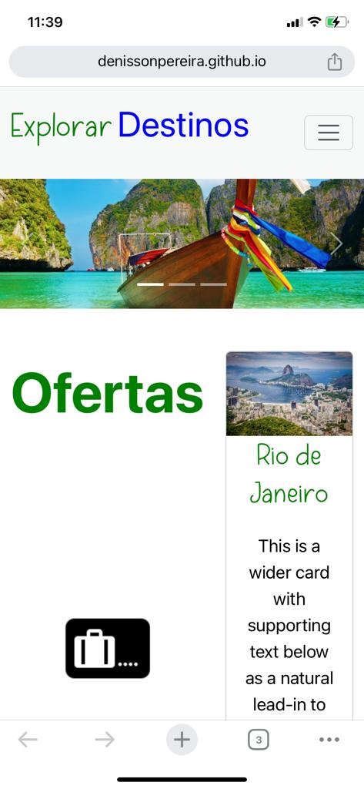
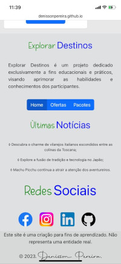

# 🚌 Explorar Destinos

# 🔍 Explore a Aplicação em Funcionamento

Convidamos você a explorar a aplicação **"Explorar Destinos"** em sua versão online: 

# 📑 Sobre o projeto 

Bem-vindo à nossa agência de viagens online **"Explorar Destinos"**, onde a magia de explorar o mundo encontra a tecnologia moderna. Desenvolvido com o poder e a flexibilidade do Bootstrap, nosso projeto oferece uma experiência envolvente e responsiva, garantindo que o planejamento de suas aventuras seja tão emocionante quanto a própria viagem. **É importante notar que este é um projeto puramente didático, não representando uma entidade real**, mas proporcionando uma visão cativante do que uma plataforma de viagens online pode oferecer. Explore, sonhe e planeje suas próximas escapadas conosco!

## 📸 Visuals and Screenshots

Dê uma espiada nas imagens abaixo para ter uma prévia visual do projeto em ação. As capturas de tela oferecem um vislumbre das principais características e do design envolvente.

### 💻 Layout web
 

### 📱 Layout mobile
 

## 📚 Stack Tecnológica

## 🌐 Implantação em produção

- Web: `GitHub Pages`

>## 🚨 Aguarde! Ainda não terminou!

>O projeto em questão representa uma agência de viagens fictícia, cuidadosamente concebida com propósitos didáticos. Este cenário imaginário oferece uma oportunidade única para explorar e aplicar diversos conceitos relacionados a desenvolvimento web, design de interfaces e lógica de programação. Importante ressaltar que a agência de viagens em questão é uma criação fictícia e não corresponde a uma entidade real no mundo físico.

>Embora fictício, o projeto foi desenvolvido com a intenção de proporcionar um ambiente de aprendizado enriquecedor. Todos os interessados são incentivados não apenas a utilizar o projeto para fins educacionais, mas também a contribuir de forma ativa. A colaboração é bem-vinda e pode abranger desde ajustes simples até implementações mais complexas, proporcionando uma experiência prática e compartilhada para o aprimoramento coletivo das habilidades e conhecimentos. O projeto serve como um campo aberto para a experimentação e o aprendizado contínuo, refletindo o espírito colaborativo da comunidade de desenvolvimento.

## 📜 Licença

Copyright (c) 2023 Denisson Pereira Santos.

 

## ✏️ Autor 

Denisson Pereira Santos

 
 
 
 

&nbsp;&nbsp;